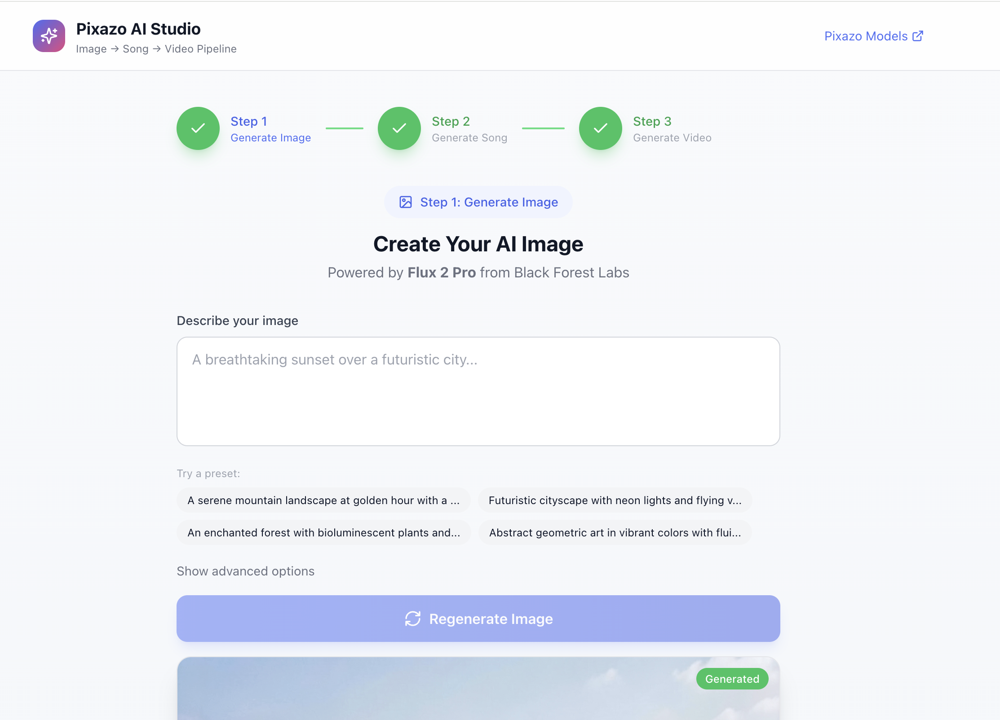
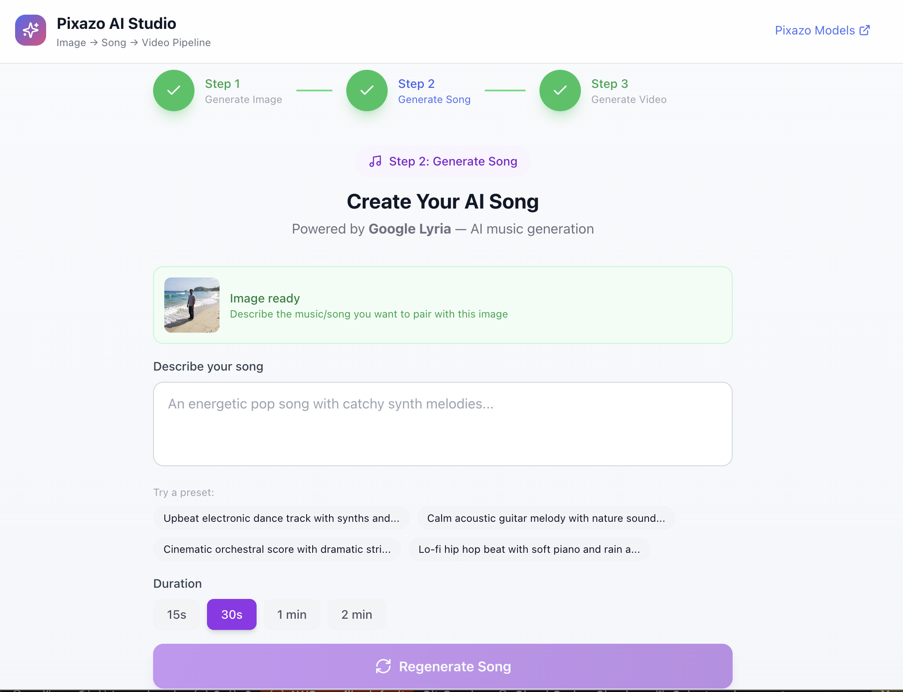
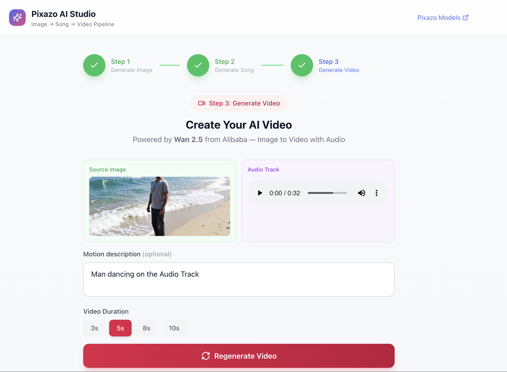

<div align="center">

# Pixazo AI Studio

### Text → Image → Music → Video — One prompt, full creative pipeline

[](https://nextjs.org/)
[](https://www.typescriptlang.org/)
[](https://tailwindcss.com/)
[](https://www.pixazo.ai/api)
[](LICENSE)

An open-source AI creative studio that chains **9 image models**, **2 music models**, **8 video models**, and **2 AI tools** through the [Pixazo AI Gateway](https://www.pixazo.ai/api) into a seamless text-to-video pipeline.

[Getting Started](#quick-start) · [Supported Models](#supported-models) · [Architecture](#architecture) · [API Reference](#api-reference) · [Contributing](CONTRIBUTING.md)

</div>

---

## How It Works

Describe what you want — the studio generates an image, creates a matching soundtrack, and combines them into a cinematic video. Each step feeds the next, or you can use any model independently.

```
Text prompt  →  AI Image  →  AI Music (optional)  →  AI Video with soundtrack
```

<table>
<tr>
<td width="33%" align="center"><b>Step 1 — Generate Image</b></td>
<td width="33%" align="center"><b>Step 2 — Generate Music</b></td>
<td width="33%" align="center"><b>Step 3 — Generate Video</b></td>
</tr>
<tr>
<td></td>
<td></td>
<td></td>
</tr>
<tr>
<td align="center"><sub>Choose a model, enter a prompt, generate</sub></td>
<td align="center"><sub>Describe your soundtrack, pick duration</sub></td>
<td align="center"><sub>Add motion description, combine image + audio</sub></td>
</tr>
</table>

---

## Features

- **Multi-Model Selection** — Pick from 21 AI models across image, music, video, and tools
- **3-Step Pipeline** — Image → Music → Video in one flow, or use models standalone
- **Music Fallback Chain** — Lyria 2 → ElevenLabs → Minimax → Stable Audio automatic failover
- **AI Tools Page** — Image-to-image style transfer and text-to-speech as standalone tools
- **Generation History** — Past creations saved locally with one-click replay
- **Light & Dark Theme** — Toggle from the header; preference persists via localStorage
- **Adaptive Polling** — Smart status polling (5s for first 10 checks, then 2s) with 6-minute timeout
- **Retry with Backoff** — Exponential retry on transient 429/502/503/504 errors
- **Skip Music** — Jump straight from image to video when you don't need a soundtrack
- **Responsive UI** — Works on desktop and mobile with smooth transitions

---

## Supported Models

### Image Models (9)

| Model | Provider | Type | Speed |
|---|---|---|---|
| **Flux 2 Klein 4B** | Black Forest Labs | Synchronous | Instant |
| **Flux 2 Pro** | Black Forest Labs | Async | ~10s |
| **Flux Dev** | Black Forest Labs | Async | ~8s |
| **Flux Pro 1.1 Ultra** | Black Forest Labs | Async | ~15s |
| **Flux 1 Schnell** | Black Forest Labs | Synchronous | Instant |
| **GPT Image 1.5** | OpenAI | Async | ~12s |
| **Recraft V4** | Recraft | Synchronous | ~5s |
| **Recraft V3** | Recraft | Synchronous | ~3s |
| **Studio Ghibli Style** | Pixazo | Async | ~20s |

### Music Models (2)

| Model | Provider | Type |
|---|---|---|
| **Google Lyria 2** | Google | Async |
| **ElevenLabs Music** | ElevenLabs | Async |

### Video Models (8)

| Model | Provider | Input |
|---|---|---|
| **Wan 2.5** | Alibaba | Image → Video |
| **Sora** | OpenAI | Image → Video |
| **Sora (Text)** | OpenAI | Text → Video |
| **Runway Gen-4.5** | Runway | Text → Video |
| **Kling 3.0 (Text)** | Kuaishou | Text → Video |
| **Kling 3.0 (Image)** | Kuaishou | Image → Video |
| **Luma Dream Machine** | Luma AI | Image → Video |
| **Veo 3.1** | Google | Text → Video |

### AI Tools (2)

| Tool | Provider | Description |
|---|---|---|
| **Image-to-Image** | Recraft / Flux Pro | Style transfer and image transformation |
| **Text-to-Speech** | ElevenLabs V3 | Natural-sounding voice synthesis |

---

## Quick Start

### Prerequisites

- **Node.js** 18+ and **npm**
- A **Pixazo API key** ([get one here](https://www.pixazo.ai/api))

### Setup

```bash
# Clone the repo
git clone https://github.com/Pixazo-AI/pixazo-ai-studio.git
cd pixazo-ai-studio

# Install dependencies
npm install

# Configure your API key
cp .env.example .env
# Edit .env → paste your Pixazo subscription key

# Start the dev server
npm run dev
```

Open **[http://localhost:3000](http://localhost:3000)** and start creating.

### Production Build

```bash
npm run build
npm start
```

---

## Getting Your Pixazo API Key

1. Go to **[pixazo.ai/api](https://www.pixazo.ai/api)** and create an account
2. Navigate to **Dashboard → API Keys**
3. Your `Ocp-Apim-Subscription-Key` is auto-generated — copy it
4. Click **Add Funds** so the AI models can process requests

> **Note:** AI model calls require account balance. Add funds before generating.

---

## Architecture

```
Browser (React)                         Next.js API Routes                    Pixazo Gateway
─────────────────                       ──────────────────                    ──────────────
useGeneration hook                      /api/generate-image ─────────────→   9 image models
  ├─ generateImage()  ──POST──→         /api/generate-music ─────────────→   2 music models
  ├─ generateMusic()  ──POST──→         /api/generate-video ─────────────→   8 video models
  ├─ generateVideo()  ──POST──→         /api/tools          ─────────────→   2 AI tools
  └─ pollStatus()     ──POST──→         /api/check-status   ─────────────→   (polling endpoints)
```

The browser never talks to Pixazo directly — API routes proxy everything so the API key stays server-side.

### Project Structure

```
pixazo-ai-studio/
├── src/
│   ├── app/
│   │   ├── api/
│   │   │   ├── generate-image/route.ts    ← Image generation (all 9 models)
│   │   │   ├── generate-music/route.ts    ← Music with fallback chain
│   │   │   ├── generate-video/route.ts    ← Video generation (all 8 models)
│   │   │   ├── check-status/route.ts      ← Unified async polling
│   │   │   └── tools/route.ts             ← Image-to-image & TTS
│   │   ├── tools/page.tsx                 ← Standalone tools UI
│   │   ├── layout.tsx                     ← Root layout + ThemeProvider
│   │   ├── page.tsx                       ← Main pipeline UI
│   │   └── globals.css                    ← Theme CSS variables
│   ├── components/
│   │   ├── ImageGenerator.tsx             ← Step 1: model picker + prompt
│   │   ├── MusicGenerator.tsx             ← Step 2: music + skip option
│   │   ├── VideoGenerator.tsx             ← Step 3: video model picker
│   │   ├── GenerationHistory.tsx          ← Saved creations list
│   │   └── StepIndicator.tsx              ← Progress bar
│   ├── context/
│   │   └── ThemeContext.tsx               ← Light/dark mode provider
│   ├── hooks/
│   │   └── useGeneration.ts              ← Pipeline state + adaptive polling
│   ├── lib/
│   │   ├── pixazo-client.ts              ← Gateway HTTP client + retry
│   │   └── models.ts                     ← Model registry (all 21 models)
│   └── types/
│       └── index.ts                      ← Shared TypeScript types
├── .env.example
├── package.json
├── tailwind.config.ts
└── tsconfig.json
```

---

## API Reference

### Internal Endpoints

| Endpoint | Method | Description |
|---|---|---|
| `/api/generate-image` | POST | Generate image (model selected by `model_id`) |
| `/api/generate-music` | POST | Generate music with automatic fallback chain |
| `/api/generate-video` | POST | Generate video from image + prompt |
| `/api/check-status` | POST | Poll async generation status |
| `/api/tools` | POST | Run standalone tools (image-to-image, TTS) |

### Gateway Pattern

All models go through the Pixazo AI Gateway at `https://gateway.pixazo.ai`:

```
POST https://gateway.pixazo.ai/{apiId}/v1/{operation}
Header: Ocp-Apim-Subscription-Key: <your-key>
Header: Content-Type: application/json
```

Some models have unique patterns — the model registry in `src/lib/models.ts` handles these automatically (Recraft skips `/v1/`, Lyria doubles its path, Wan uses a separate API for polling).

### Example: Generate an Image

```bash
curl -X POST http://localhost:3000/api/generate-image \
  -H "Content-Type: application/json" \
  -d '{
    "prompt": "a sunset over mountains, oil painting style",
    "model_id": "flux-2-klein",
    "width": 1024,
    "height": 1024
  }'
```

### Example: Generate Music

```bash
curl -X POST http://localhost:3000/api/generate-music \
  -H "Content-Type: application/json" \
  -d '{
    "prompt": "upbeat electronic music with dreamy synths",
    "duration": 15
  }'
```

---

## Environment Variables

| Variable | Required | Default | Description |
|---|:---:|---|---|
| `PIXAZO_API_KEY` | Yes | — | Your Pixazo gateway subscription key |
| `PIXAZO_GATEWAY_URL` | No | `https://gateway.pixazo.ai` | Gateway base URL (override for self-hosted) |

---

## Tech Stack

- **[Next.js 14](https://nextjs.org/)** — App Router with React Server Components
- **[React 18](https://react.dev/)** — Client components with hooks
- **[TypeScript](https://www.typescriptlang.org/)** — Full type safety
- **[Tailwind CSS](https://tailwindcss.com/)** — Utility-first styling with custom color tokens
- **[Lucide React](https://lucide.dev/)** — Icon library
- **[Pixazo AI Gateway](https://www.pixazo.ai/api)** — Unified API for 10+ AI providers

No axios, no state libraries — just `fetch`, React hooks, and Tailwind.

---

## Troubleshooting

| Issue | Solution |
|---|---|
| **502 on polling** | Models may be warming up. The app retries automatically with exponential backoff. |
| **InvalidParameter on video** | Ensure the image URL from Step 1 is publicly accessible. |
| **Duration mismatch on music** | Lyria works best with 15s or 30s durations. |
| **Recraft 404** | Recraft uses a non-standard URL pattern (no `/v1/`). This is handled automatically. |
| **API key errors (401/403)** | Check your key at [pixazo.ai](https://www.pixazo.ai) and ensure you have sufficient funds. |

---

## Contributing

We welcome contributions! See [CONTRIBUTING.md](CONTRIBUTING.md) for guidelines on how to get started.

---

## License

[MIT](LICENSE)

---

<div align="center">

**Built with [Pixazo AI Gateway](https://www.pixazo.ai/api)**

Flux · Lyria · Wan · Sora · Runway · Kling · Luma · Veo · Recraft · GPT Image · ElevenLabs · Studio Ghibli

</div>
